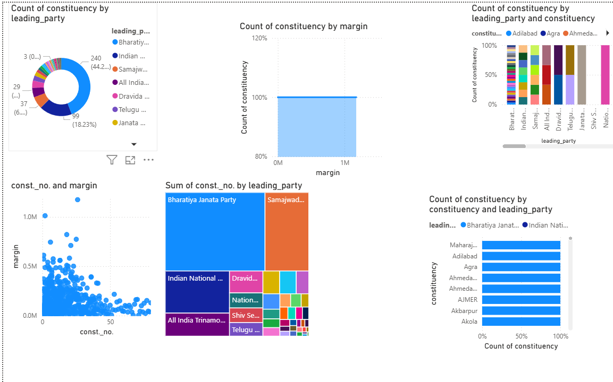
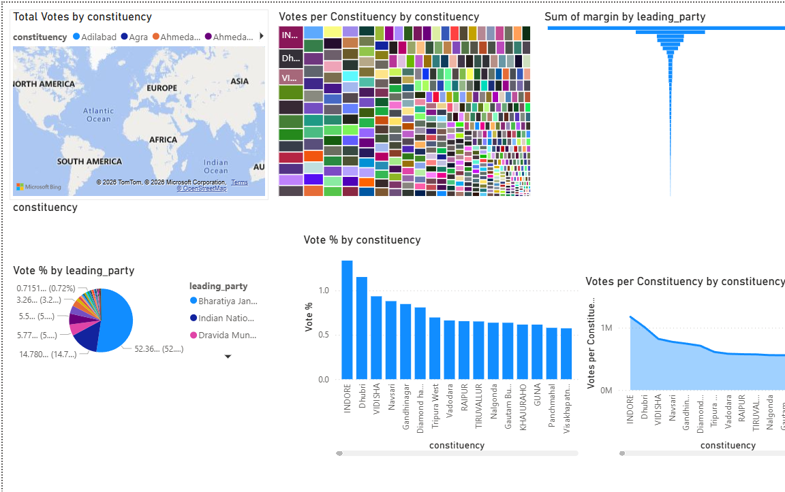

# 🇮🇳 Lok Sabha Election Analysis 2024

## Overview

An interactive Power BI dashboard analyzing the 2024 Indian General Election.

## Tools Used

- Power BI
- DAX
- Power Query
- Python
- Pandas

## Dataset

Lok Sabha Election Results 2024 India 

## Features

- Party-wise Seat Share
- Winning Margin Analysis
- Vote Percentage Analysis
- Constituency Comparison
- Interactive Filtering

## Dashboards

### Dashboard 1

### Dashboard 2

## Future Improvements

- State drill-down
- Coalition Analysis
- 2019 vs 2024 comparison
- Mobile dashboard
